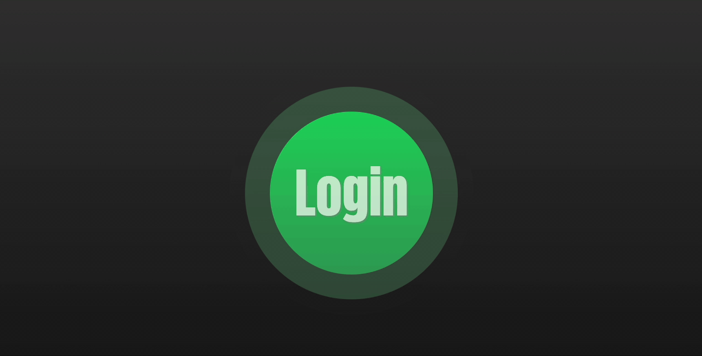

<div align="center">
  <h1>Welcome to Coda</h1>
  <h3>Your personal Spotify stats to view your recently top artists, tracks, &amp; genres!</h3>
  
  <br />
  <br />
  
  <div>
    <h3>What does 'Coda' mean?</h3>
    <p>Coda is a musical term that typically refers to the concluding passage of a piece or movement that is distinct from the main structure. This application is named Coda, because it's taking your music stats based off your choice of concluding time frame.</p>
  </div>
  
  <br />
  
  <div>
    <h3>Getting started and logging in</h3>
    <div style="display:block;text-align:center">
      
    </div>
    <p>Clicking on the Login logo will redirect you to Spotify's authorization page, which is where you will need to login with your Spotify account!</p>
    <div style="display:block;text-align:center">
      
    </div>
  </div>
  
  <br />

  <div>
    <h3> Viewing your home page </h3>
    <div style="display:block;text-align:center">
      
    </div>
    <p>This is where you'll see your personalized stats. Clicking on each carousel indicator will allow you to toggle between your top tracks, artists, and genres.</p>
  </div>

  <br />

  <div>
    <h3> Picking your time frame </h3>
    <div style="display:block;text-align:center">
      
    </div>
    <p>You can also choose to view your stats within the last month, 6 months, or several years.</p>
  </div>

  <br />

  <div>
    <h3>What do I do if my application can't run?</h3>
    <p>If you're running into a cors error, please place the following line of code into your terminal. Then, run the localhost within that browser.</p>
    ```
    /Applications/Google\ Chrome.app/Contents/MacOS/Google\ Chrome --user-data-dir="/tmp/chrome_dev_session" --disable-web-security
    ```
  </div>
</div>
